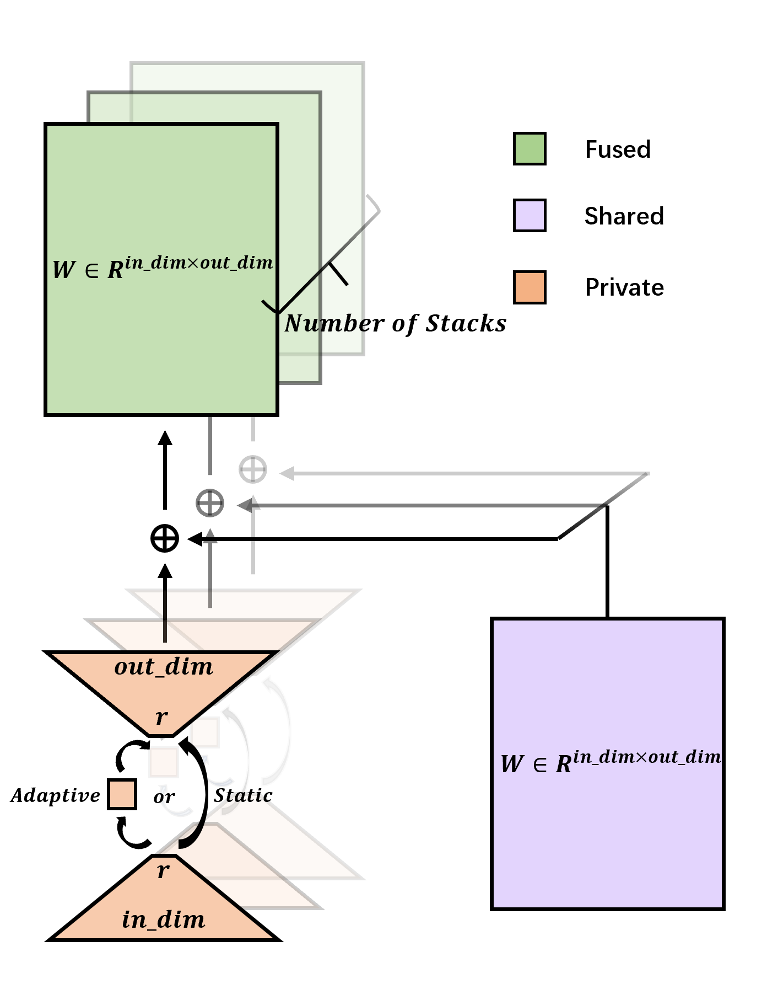

# LORS: Low-rank Residual Structure for Parameter-Efficient Network Stacking

<!-- 

-->

 :grapes: \[[Read our arXiv Paper](https://arxiv.org/abs/2403.04303)\] &nbsp; 

---

    

## :bulb: Notice

- **Applying LORS to AdaMixer.**  The code is implemented as a python class called `FactorizedAdaptiveMixing`, located in the file _AdaMixer_with_LORS/mmdet/models/roi_heads/bbox_heads/factorized_adaptive_mixing_operator.py_.
- **Applying LORS to Transformer(Deit-Tiny).** The code consists of python class `MultiheadAttention_LORS` and `FFN_LORS`, implemented in the file _DeiT-Tiny_with_LORS/mmcls/models/backbones/lors_vit.py_.

## :fire: News
* **`2024.04.22`** Release training and inference codes.
* **`2024.04.05`** LORS is selected as a **highlight** poster.
* **`2024.02.27`** LORS is accepted by CVPR 2024.

<!--
## :label: TODO 
- [x] Release checkpoints.
-->
